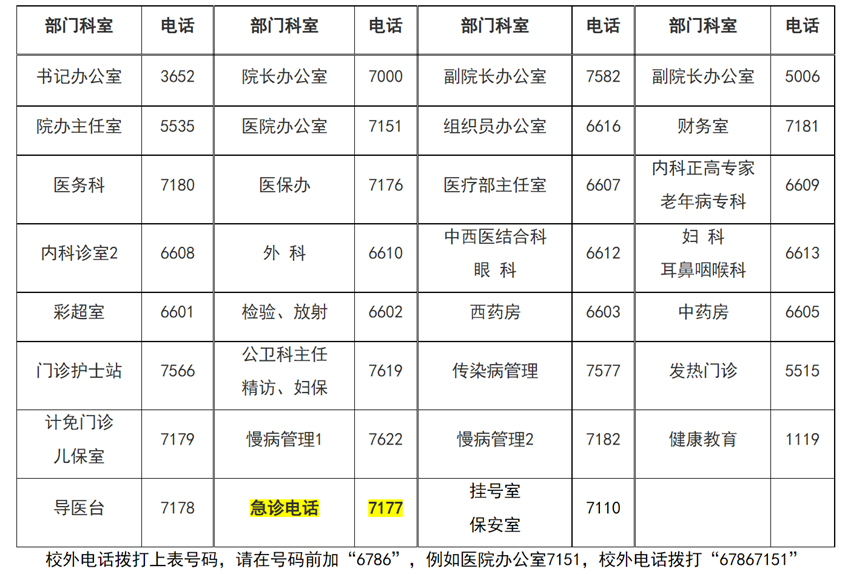
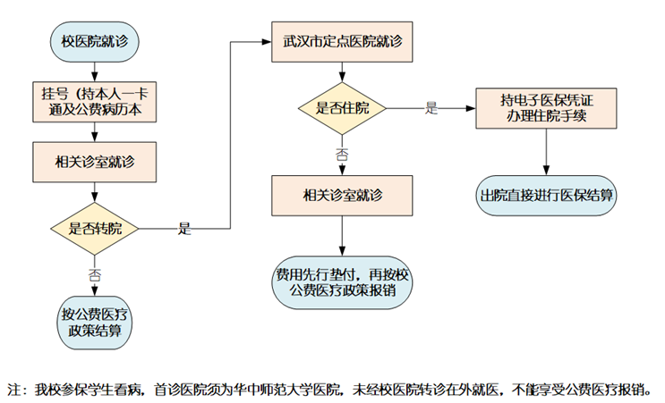

# 医疗服务

## 校医院

### 1.校医院地址

华中师范大学医院位于华中师范大学校内，9号教学楼后侧，图书馆附近。

### 2.电话

### 3.办理病历

本校学生首次办理病历时，需带上本人学生证、近期免冠正面照片一张，交纳工本费。病历用完后，将旧病历交回校医院财务室，取新病历时，需带上近期免冠正面照片一张，交纳工本费。如病历遗失，需持所在单位证明，到校医院财务室办理挂失手续，自挂失之日起一个月内就诊自费。一月后准予补办病历，并请带上单位证明、工作证或学生证、近期免冠正面照片一张，交纳工本费及手续费。

### 4.大学生医保

#### 大学生异地或医保医院住院报销所需材料

##### 医院方提供：

1. 费用单据（发票原件）
2. 住院费用汇总清单（原件）
3. 出院小结
4. 全套病案资料：病案首页、临时医嘱、长期医嘱、化验单、检查报告、病理结果、手术记录（如是全身麻醉，需要提供麻醉记录）
5. 异地就医须提供医院等级证明
6. 使用置换材料的需附诊疗项目审批进价表或发票复印件
7. 放化疗费及治疗费用明细表
8. 转院审批表

说明：1、2、3、4、5项材料必备（未做手术者不需手术记录），6、7、8项若涉及也须提供。请向院方索要。

##### 本人提供：

1. 大学生异地实习，需学校和实习单位出具证明
2. 住院现金报销需本人提供情况说明
3. 如是外伤，需要附：无第三方责任人，如有虚假，愿负法律责任。
4. 外伤需拆除钢板等手术，如上次手术不在医保内完成，则需提供上次手术发病历复印件。
5. 意外伤害就医的，须提供交通事故认定书、法院判决书、调解协议书等公检法部门出具的相关证明材料，无法提供的应填写个人承诺书。
6. 身份证复印件一份
7. 本人银行卡复印件一张，注明：银行卡号、联系电话、银行卡开户行

#### 大学生医保报销流程

### 5.挂号

去挂号前带好自己的校园卡和学校统一发放的病历本，在校医院挂号窗口挂号或者用校园卡自助挂号就可以啦，缴费时可以校园卡支付也可以扫码支付。

### 6.转诊

## 心理咨询

### 地址

本部：文华公书林（老图书馆）三楼西侧

南湖：南湖综合楼一楼109教室旁

### 电话

027-67868152；027-67868156；
027-67861923（南湖分中心）

### 预约流程

学生凭一卡通到中心填写预约登记表——分诊评估——安排咨询或转介

[文本材料来源](https://docs.qq.com/sheet/DU3pZRWFBVm9lVm13)