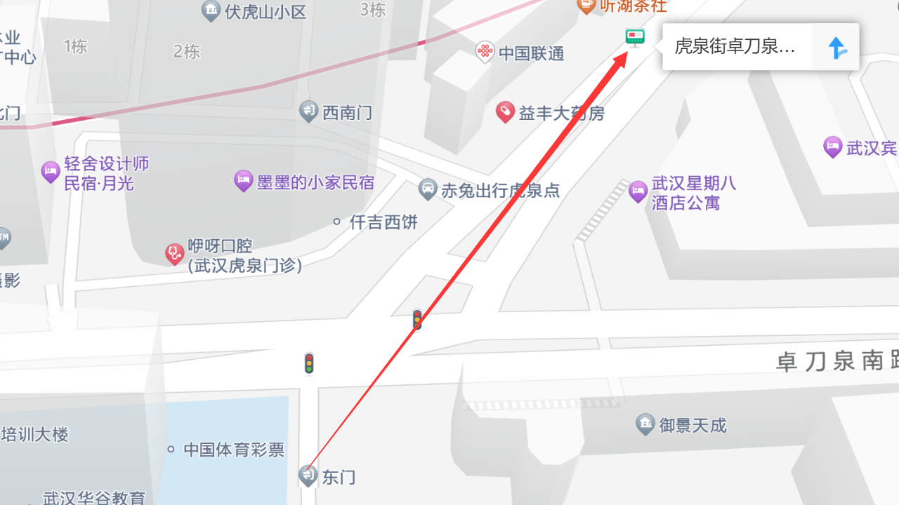

# 校外交通
## 地铁
华中师范大学北门——广埠屯地铁站

华中师范大学东门——虎泉地铁站

华师桂子山校区（我们常说的本部）的北门和东门均有地铁2号线连接，但由于武汉地铁早年间较为spider地铁规划，2号线不管何时何地，都有着人挤人的传统，所以萌新宝宝要做好心理准备啊，但好处就是现在的2号线很好地将华师与武汉许多有意思的地方连接起来，直接通达。

### 2号线热门站点
- 光谷广场：光谷步行街，世界城广场，鲁巷购物广场等构成的光谷商圈
- 虎泉：即华师东门，武汉有名的小商品市场和夜市
- 街道口：即华师西门（从北门出来也很近），群光广场、珞珈创意城、乐天城等构成的街道口商圈
- 江汉路：武汉热门商业街，一条街享受美食与购物的双重乐趣

### 4号线热门站点
楚河汉街：有高大上的汉秀剧场和万达电影乐园等，建筑独具特色

## 公交车站
#### 华中师范大学北门——珞喻路广埠屯公交站
通达路线：510路;518路;538路;59路;703路;715路;728路;804路;905路;YX518路;YX703路;鄂101路

#### 华中师范大学东门——卓刀泉南路虎泉公交站
通达路线：596路;618路;715路;72路;804路

#### 华中师范大学东门——虎泉街卓刀泉南路公交站
通达路线：386路;538路

#### 华中师范大学南湖校区——雄楚大道BRT公交站
通达路线：15路;556路;586路;625路;723路;72路;804路;811路;BRT1路
